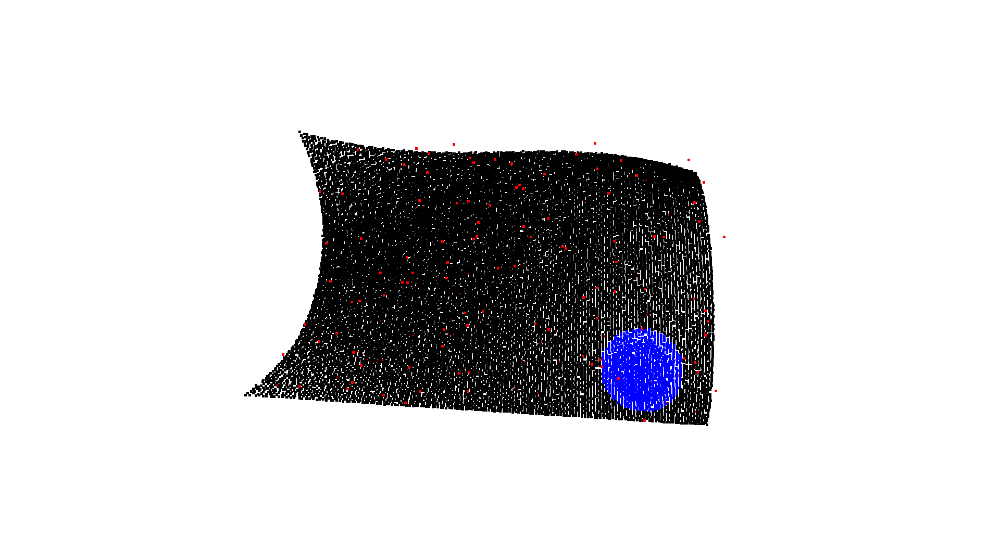
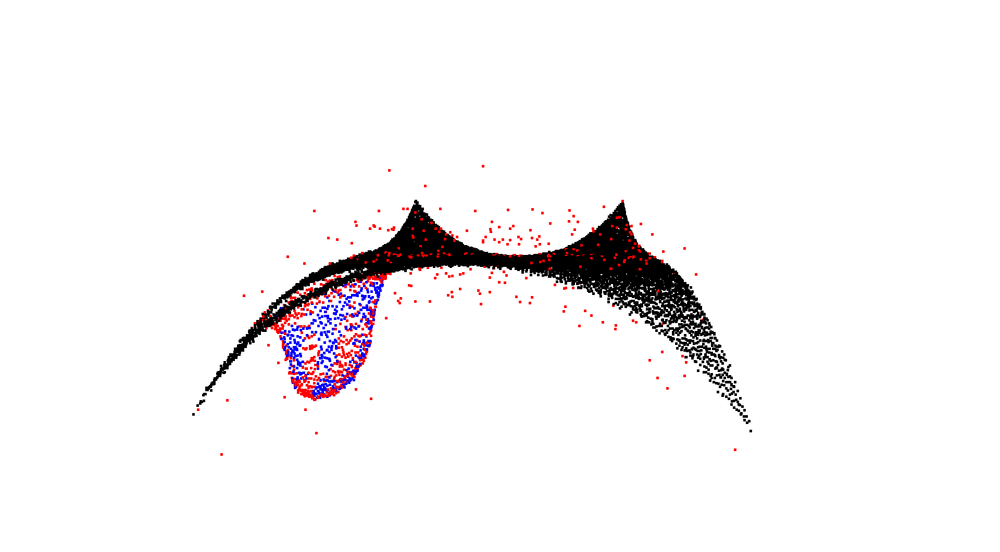
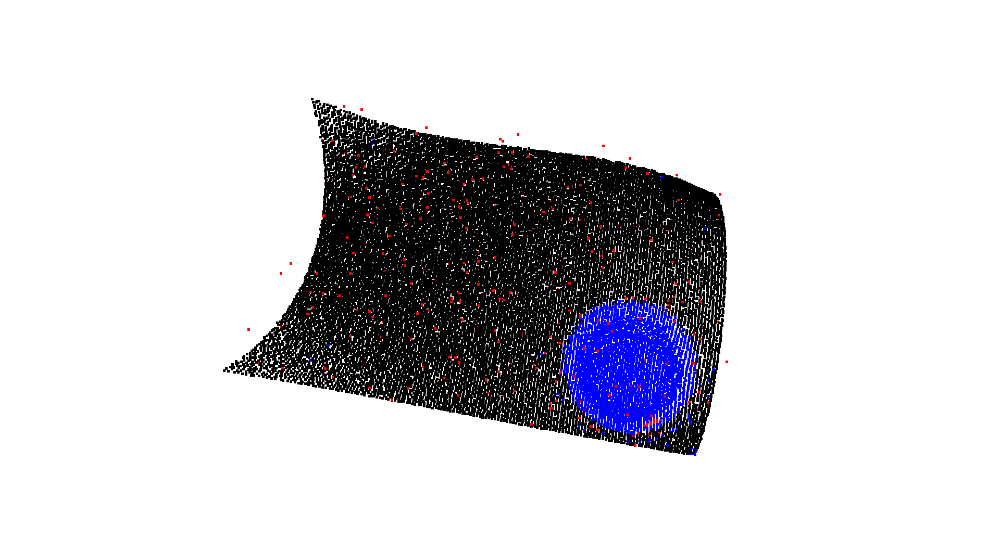
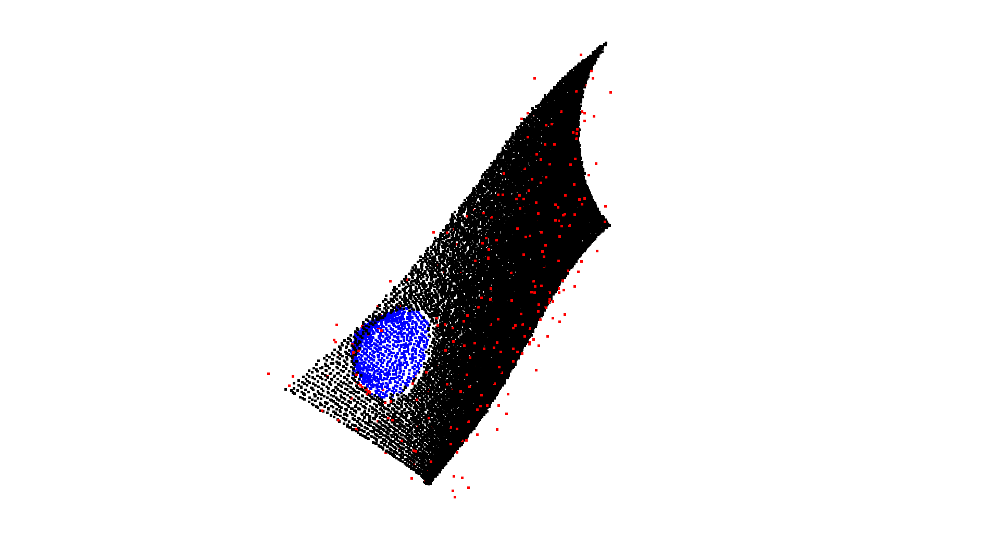
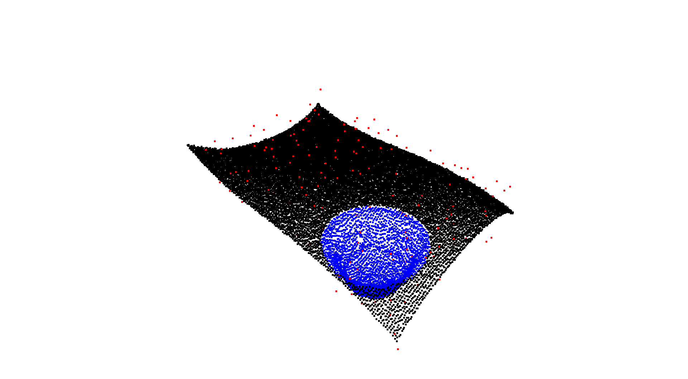
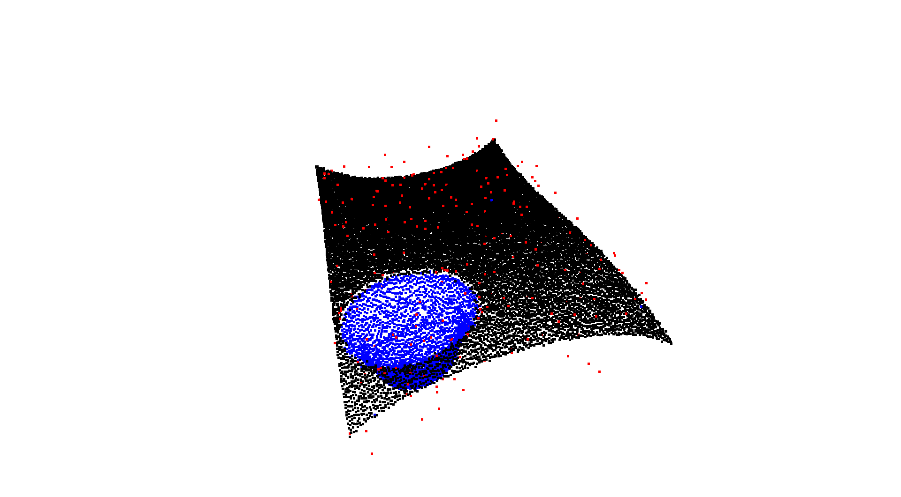

# Reproduce Report

## EM_options for generating point cloud 

```
class EM_options(
    bg_k: float,
    outliers_rate: float,
    defect_depth: int,
    defect_radius: float,
    trans: float,
    defect_pos: ndarray,
    spline_paras: Unknown | None = None,
    spline_knot: Unknown | None = None,
    bg_size: float = 20,
    bg_std_depth: float = 0.15,
    bg_std_xy: float = 0.02,
    outliers_std_depth: float = 1.5,
    outliers_std_xy: float = 0.02,
    step: float = -0.45,
    spline_flag: bool = True
)
```

Single_Experiment setting (for depth 3):
``` 
options = EM_options(0.0004, 0.01, 3, 2.4, 1.5, defect_pos=np.array([[-0.0], [-0.0]]), bg_std_depth=0.10, step=-0.4, spline_flag=False) 
```

- bg_k: reference surface shape
  - alternate example: 0.001
  
- outliers_rate: number of outliers
  - alternate example: 0.1
  
- defect_depth, defetct_radius, trans: see below image (cropped from the paper)


defect_depth: $d$

defect_radius: $r_2$

trans: $\tau = \frac{r_2}{r_1}$, steepness, smaller --> steeper

- defect_pos: defect position (x,y)
  - alternate example: (-0.9, -1.4)
  

- bg_std_depth: different noise variance, refer to experiment 1 in 5.1.1 in the paper
  - alternate example: 0.15
  

- step: <0, absolute value = the gap between surface and red defect area (mentioned in the top left parts of the paper on page 1182 and Figure 6), note that the blue defact part does not move down accordingly


## Experiments

### Repeat
|Experiment d=3 | FPR   | FNR |
| -------- | ------- | ------- |
| original (30 experiments average)  | 1.07761704e-05   | 0.0851115 |
| 5 experiments average   |  1.8478311082367072e-05   | 0.05334157015366224|
| single experiment | 0.0   | 0.03213957759412305 |


|Experiment d=7 | FPR   | FNR |
| -------- | ------- | ------- |
| original (30 experiments average)  | 0.00407483847  |  0.01899044 |
| 5 experiment average   |  0.0033792474280080684  | 0.018663362763552894 |
| single experiment| 0.004533243787777031    | 0.01137521222410866|

### Generate Defect on Corners

- Single Experiment:

>File: Single_Experiment.py (modify options accordingly)
>
>Data: not saved
>
>Options:
>
> ```
>options = EM_options(0.0008, 0.01, 3, 2.4, 1.5, defect_pos=np.array([[-0.9], [-1.4]]), bg_std_depth=0.1, step=-0.35, spline_flag=False)
>```
>

- 30 Samples Experiments:

>File: Reproduce_30Experiments.py (with command line args)
>
>e.g: python Reproduce_30Experiments.py --bg_k 0.0004 --x -0.7 --y -1.4 --d 3 --r 2.4 --range 0.5
>
>Data: Reproduce_corner_result/Depth_[d]_R[r]_bgk[bg_k]/data3
>
>Options:
>
> ```
>depth = 3
>positions = np.array([[x], [y]]) + np.random.uniform(-range, range, (2, num_experiments))
>for i in range(num_experiments):
>  cur_pos = positions[:, i: i + 1]
>  options = EM_options(bg_k, 0.01, d, r, 1.5, cur_pos, bg_std_depth=0.10, step=-0.35, spline_flag=False)
>```
>

#### bk_g = 0.0008, Depth = 3, R = 2.4

- Example Sample:

Ground Truth:


Predicted:


- 30 Samples Experiments:

```
python Reproduce_30Experiments.py --bg_k 0.0008 --x -0.7 --y -1.4 --d 3 --r 2.4 --range 0.5
```

|Experiment bg_k=0.0008, d=3, r=2.4 | FPR   | FNR |
| -------- | ------- | ------- |
| Single Experiment | 0.000323265909300822  | 0.11194029850746269 |
| 30 Experiments average | 0.00030863243840739533   | 0.10106883983157165 |

#### bk_g = 0.0008, Depth = 7, R = 2.4

- Example Sample:

Ground Truth:


.png)

Predicted:

.png)

- 30 Samples Experiments:

```
python Reproduce_30Experiments.py --bg_k 0.0008 --x -0.7 --y -1.4 --d 7 --r 2.4 --range 0.5
```

|Experiment bg_k=0.0008, d=7, r=2.4 | FPR   | FNR |
| -------- | ------- | ------- |
| Single Experiment | 0.0  | 0.5643656716417911 |
| 30 Experiments average | 0.00018113566847798642   | 0.5630658911177207 |

#### bk_g = 0.0008, Depth = 7, R = 4

- Example Sample:

Ground Truth:

Predicted:


- 30 Samples Experiments:

```
python Reproduce_30Experiments.py --bg_k 0.0008 --x -0.5 --y -1.1 --d 7 --r 4 --range 0.3
```

|Experiment bg_k=0.0008, d=7, r=4 | FPR   | FNR |
| -------- | ------- | ------- |
| Single Experiment | 0.0019368295589988081 | 0.08857808857808858 |
| 30 Experiments average | 0.0014987994024467527   | 0.04073500973066669 |


#### bk_g = 0.0004, Depth = 3, R = 2.4

- Example Sample:

Ground Truth:

Predicted:


- 30 Samples Experiments:

```
python Reproduce_30Experiments.py --bg_k 0.0004 --x -0.7 --y -1.4 --d 3 --r 2.4 --range 0.5
```

|Experiment bg_k=0.0004, d=3, r=2.4 | FPR   | FNR |
| -------- | ------- | ------- |
| Single Experiment | 4.6180844185831714e-05 | 0.07555970149253731 |
| 30 Experiments average | 2.918740400449493e-05   | 0.08358546054176388 |


#### bk_g = 0.0004, Depth = 7, R = 4

- Example Sample:

Ground Truth:

Predicted:


- 30 Samples Experiments:

```
python Reproduce_30Experiments.py --bg_k 0.0004 --x -0.5 --y -1.1 --d 3 --r 2.4 --range 0.3
```

|Experiment bg_k=0.0004, d=7, r=4 | FPR   | FNR |
| -------- | ------- | ------- |
| Single Experiment | 0.0004964257347100874 | 0.05366666666666667 |
| 30 Experiments average | 0.00058562598213365   | 0.035372197774294775 |

#### Result Summary (defect around corners)

|Experiment | Data | FPR (average)  | FNR (average)|
| -------- | ------- | ------- | ------- |
| bg_k=0.0004, d=3, r=2.4 | Code/Reproduce_corner_result/Depth_3_R2.4_bgk0004/data3 | 2.918740400449493e-05   | 0.08358546054176388 |
| bg_k=0.0004, d=5, r=2.4 | --- | ---  |---|
| bg_k=0.0004, d=7, r=2.4 | --- | ---   | --- |
| bg_k=0.0004, d=7, r=4 | Code/Reproduce_corner_result/Depth_7_R4_bgk0004/data3 | 0.00058562598213365   | 0.035372197774294775 |
| bg_k=0.0008, d=3, r=2.4 | Code/Reproduce_corner_result/Depth_3_R2.4_bgk0008/data3 | 0.00030863243840739533   | 0.10106883983157165 |
| bg_k=0.0008, d=5, r=2.4 | --- | ---  |---|
| bg_k=0.0008, d=7, r=2.4 | Code/Reproduce_corner_result/Depth_7_R2.4_bgk0008/data3 | 0.00018113566847798642   | 0.5630658911177207 |
| bg_k=0.0008, d=7, r=4 | Code/Reproduce_corner_result/Depth_7_R4_bgk0008/data3 | 0.0014987994024467527   | 0.04073500973066669 |


