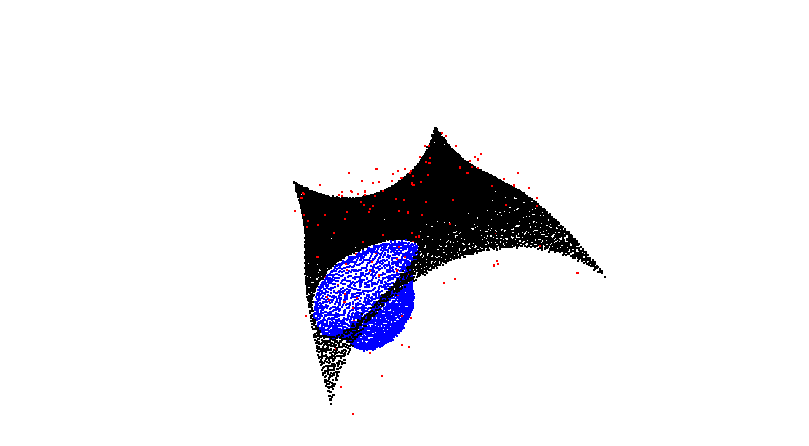

# Reproduce Report

## EM_options for generating point cloud 

```
class EM_options(
    bg_k: float,
    outliers_rate: float,
    defect_depth: int,
    defect_radius: float,
    trans: float,
    defect_pos: ndarray,
    spline_paras: Unknown | None = None,
    spline_knot: Unknown | None = None,
    bg_size: float = 20,
    bg_std_depth: float = 0.15,
    bg_std_xy: float = 0.02,
    outliers_std_depth: float = 1.5,
    outliers_std_xy: float = 0.02,
    step: float = -0.45,
    spline_flag: bool = True
)
```

Single_Experiment setting (for depth 3):
``` 
options = EM_options(0.0004, 0.01, 3, 2.4, 1.5, defect_pos=np.array([[-0.0], [-0.0]]), bg_std_depth=0.10, step=-0.4, spline_flag=False) 
```

- bg_k: reference surface shape
  - alternate example: 0.001
  
- outliers_rate: number of outliers
  - alternate example: 0.1
  
- defect_depth, defetct_radius, trans: see below image (cropped from the paper)


defect_depth: $d$

defect_radius: $r_2$

trans: $\tau = \frac{r_2}{r_1}$, steepness, smaller --> steeper

- defect_pos: defect position (x,y)
  - alternate example: (-0.9, -1.4)
  

- bg_std_depth: different noise variance, refer to experiment 1 in 5.1.1 in the paper
  - alternate example: 0.15
  

- step: <0, absolute value = the gap between surface and red defect area (mentioned in the top left parts of the paper on page 1182 and Figure 6), note that the blue defact part does not move down accordingly


## Experiments

### Repeat
|Experiment d=3 | FPR   | FNR |
| -------- | ------- | ------- |
| original (30 experiments average)  | 1.07761704e-05   | 0.0851115 |
| 5 experiments average   |  1.8478311082367072e-05   | 0.05334157015366224|
| single experiment | 0.0   | 0.03213957759412305 |


|Experiment d=7 | FPR   | FNR |
| -------- | ------- | ------- |
| original (30 experiments average)  | 0.00407483847  |  0.01899044 |
| 5 experiment average   |  0.0033792474280080684  | 0.018663362763552894 |
| single experiment| 0.004533243787777031    | 0.01137521222410866|

### Generate Defect on Corners
#### Depth = 3, R = 2.4

- Single Experiment:
>File: Single_Experiment.py (with modified options)
>
>Data: not saved
>
>Options:
>
> ```
>options = EM_options(0.0008, 0.01, 3, 2.4, 1.5, defect_pos=np.array([[-0.9], [-1.4]]), bg_std_depth=0.1, step=-0.35, spline_flag=False)
>```
>
Ground Truth:


Predicted:


- 30 Samples Experiments

>File: EM_DRG_Depth_3_reproduce_corner.py (with modified options)
>
>Data: Reproduce_corner_result/Depth_3/data3
>
>Options:
>
> ```
>depth = 3
>positions = np.array([[-0.7], [-1.4]]) + np.random.uniform(-0.5, 0.5, (2, num_experiments))
>for i in range(num_experiments):
>  cur_pos = positions[:, i: i + 1]
>  options = EM_options(0.0008, 0.01, depth, depth * 0.8, 1.5, cur_pos, bg_std_depth=0.10, step=-0.35, spline_flag=False)
>```
>
|Experiment d=3, r=2.4 | FPR   | FNR |
| -------- | ------- | ------- |
| Single Experiment | 0.000323265909300822  | 0.11194029850746269 |
| 30 Experiments average | 0.00030863243840739533   | 0.10106883983157165 |

#### Depth = 7, R = 2.4

- Single Experiment:
>File: Single_Experiment.py (with modified options)
>
>Data: not saved
>
>Options:
>
> ```
>options = EM_options(0.0008, 0.01, 7, 2.4, 1.5, defect_pos=np.array([[-0.9], [-1.4]]), bg_std_depth=0.1, step=-0.35, spline_flag=False)
>```
>
Ground Truth:


.png)

Predicted:

.png)

- 30 Samples Experiments

>File: EM_DRG_Depth_7_reproduce_corner.py (with modified options)
>
>Data: Reproduce_corner_result/Depth_7/data3
>
>Options:
>
> ```
>depth = 7
>positions = np.array([[-0.7], [-1.4]]) + np.random.uniform(-0.5, 0.5, (2, num_experiments))
>for i in range(num_experiments):
>  cur_pos = positions[:, i: i + 1]
>  options = EM_options(0.0008, 0.01, depth, 2.4, 1.5, cur_pos, bg_std_depth=0.10, step=-0.35, spline_flag=False)
>```
>

|Experiment d=7, r=2.4 | FPR   | FNR |
| -------- | ------- | ------- |
| Single Experiment | 0.0  | 0.5643656716417911 |
| 30 Experiments average | 0.00018113566847798642   | 0.5630658911177207 |

#### Depth = 7, R = 4

- Single Experiment:
>File: Single_Experiment.py (with modified options)
>
>Data: not saved
>
>Options:
>
> ```
>options = EM_options(0.0008, 0.01, 7, 4, 1.5, defect_pos=np.array([[-0.7], [-1.3]]), bg_std_depth=0.1, step=-0.35, spline_flag=False)
>```
>
Ground Truth:

Predicted:


- 30 Samples Experiments

>File: EM_DRG_Depth_7_reproduce_corner.py (with modified options)
>
>Data: Reproduce_corner_result/Depth_7_R4/data3
>
>Options:
>
> ```
>depth = 7
>positions = np.array([[-0.5], [-1.1]]) + np.random.uniform(-0.3, 0.3, (2, num_experiments))
>for i in range(num_experiments):
>  cur_pos = positions[:, i: i + 1]
>  options = EM_options(0.0008, 0.01, depth, 4, 1.5, cur_pos, bg_std_depth=0.10, step=-0.35, spline_flag=False)
>```
>

|Experiment d=7, r=4 | FPR   | FNR |
| -------- | ------- | ------- |
| Single Experiment | 0.0019368295589988081 | 0.08857808857808858 |
| 30 Experiments average | 0.0014987994024467527   | 0.04073500973066669 |